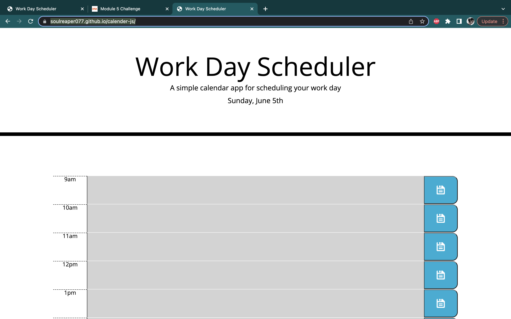

# calender-js
this is the assignment for module 5, in this project, we were instructed to carryout a workday planner so that it may be easier to keep track of tasks during the day. we had to make separate columns for every hour and include text boxes in order to write down information for that hour. once the form has been completed, the user should be able to save their data on the page and not worry about loosing anything once the page a=has been refreshed. 

## link to deployed website 
[calender-js](https://soulreaper077.github.io/calender-js/)

## other 
HTML
CSS
JS

### pics of the deployed website 

